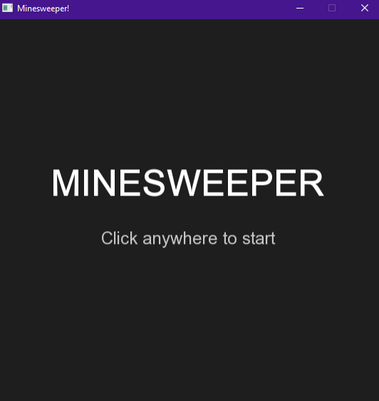
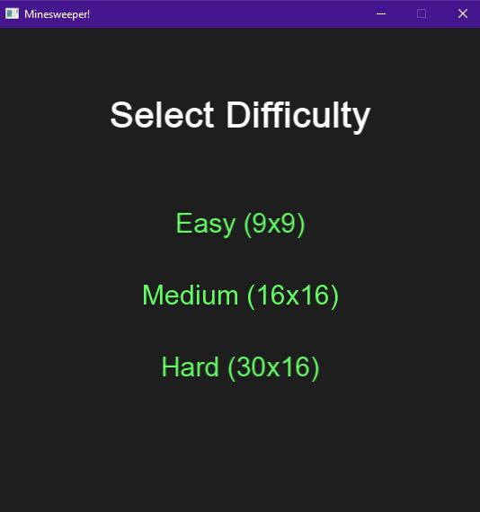

# Minesweeper_Clone 💣

A fully functional, polished Minesweeper game built from scratch using **C++** and the **SFML**. 

## 🎮 What It Does
This project recreates the classic desktop puzzle game, challenging players to clear a hidden grid without detonating any mines. It features a clean, modern UI and implements all standard Minesweeper logic, including tile revealing, flag placement, and recursive empty-space clearing.

### Key Features
* **Three Difficulty Levels:** Choose from Easy (9x9), Medium (16x16), or Hard (30x16).
* **Classic Mechanics:** Left-click to reveal a tile, right-click to place a flag on suspected mines.
* **Recursive Revealing:** Clicking a safe, empty space automatically clears all adjacent safe tiles.
* **Polished UI:** Features centered interactive menus, dynamic hover effects, and distinct win/loss states.

## 📸 Screenshots & Gameplay

### Start Screen
 
### Difficulty Menu


### Gameplay
https://github.com/user-attachments/assets/28040636-c6d9-4f21-a412-fb569162fc93

## 🛠️ Technologies Used
* **Language:** C++
* **Graphics Library:** SFML (Simple and Fast Multimedia Library) 2.6.1
* **Environment:** Visual Studio 

## 🚀 Getting Started

### Prerequisites
To build and run this project locally, you will need:
* Visual Studio (with C++ development tools installed)
* [SFML 2.6.1 (64-bit)](https://www.sfml-dev.org/download/sfml/2.6.1/) linked to your environment.

### Installation & Execution
1. Clone the repository:
   ```bash
   git clone [https://github.com/dennysnguyen/Minesweeper_Clone.git](https://github.com/dennysnguyen/Minesweeper_Clone.git)
